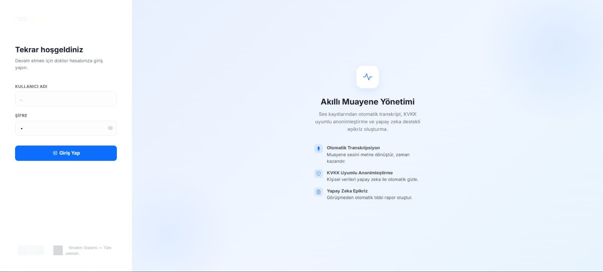
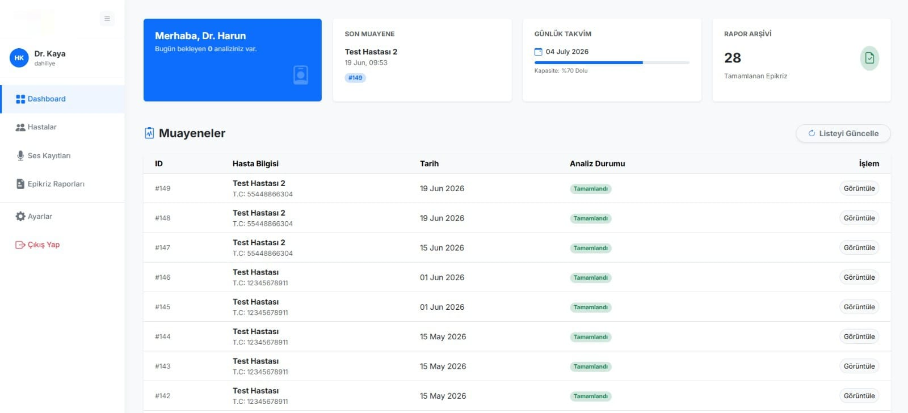
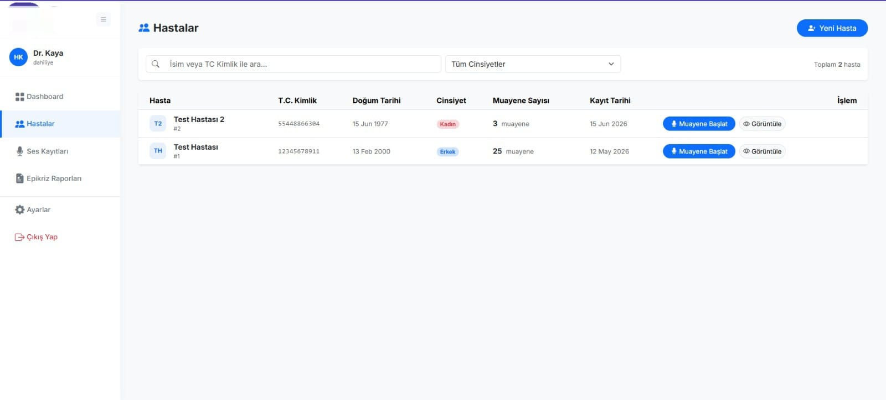
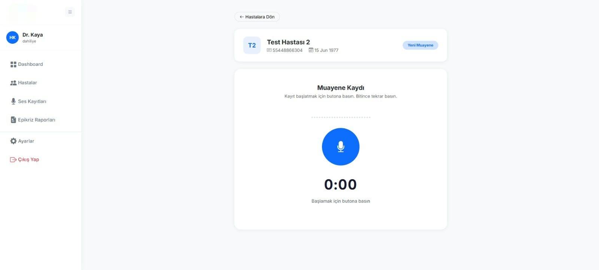
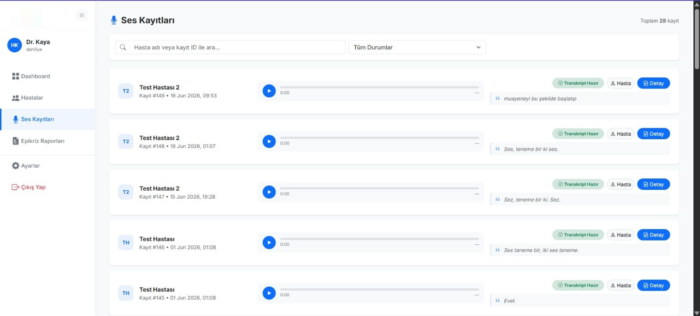
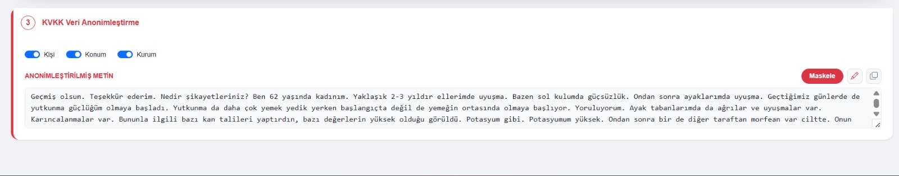
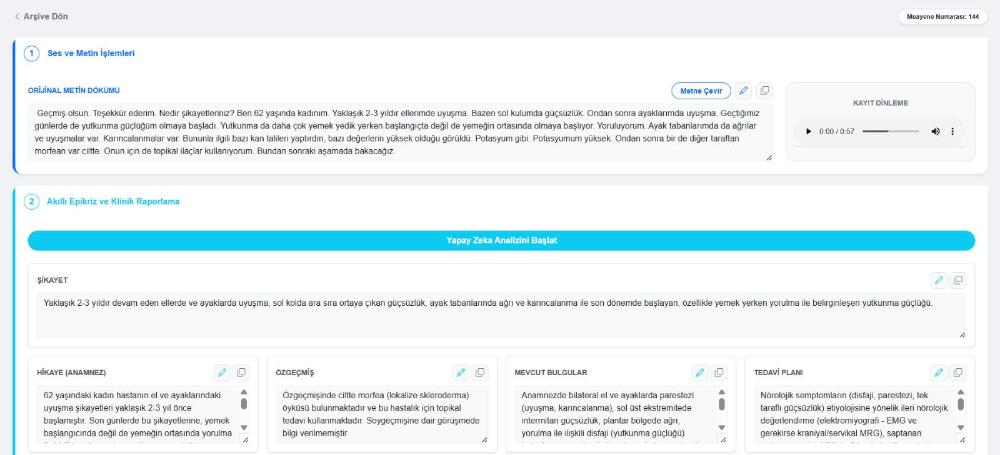
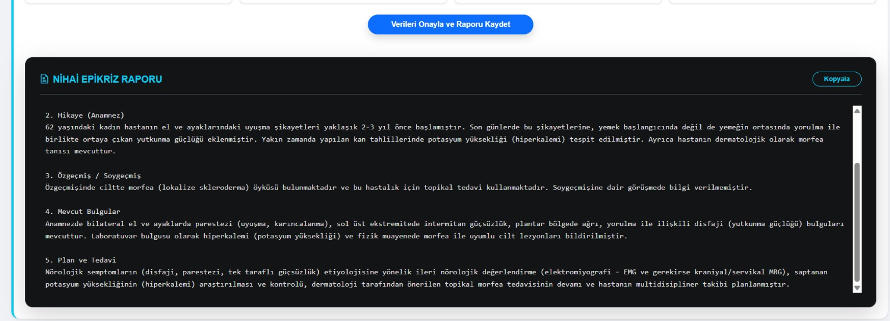
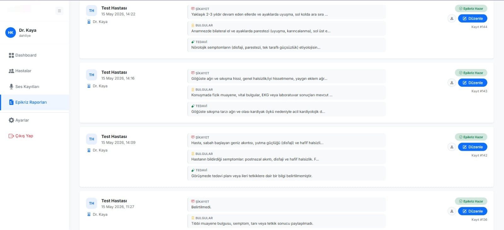

# AI-Powered Medical Examination & Epicrisis System

> **Note:** The source code for this repository is kept private as it was developed as a commercial internship project. This README serves as a showcase of the system architecture, my individual contributions, and the integrated technologies (Hardware + AI + Software).

## Project Overview
This project is an end-to-end smart healthcare assistant designed to digitize and automate medical consultations. By integrating an ESP32 microcontroller with an advanced AI pipeline, the system records doctor-patient conversations, transcribes the audio to text, automatically anonymizes sensitive data for compliance, and generates structured medical reports (Epicrisis).

## Technologies Used
* **Hardware (IoT):** ESP32 Microcontroller (Secure audio capturing and streaming)
* **Backend:** Python, Django, RESTful APIs
* **Artificial Intelligence & NLP:** * Custom NER (Named Entity Recognition) Model
  * LLM APIs for clinical text summarization
  * Speech-to-Text Processing
* **Frontend:** Web-based Doctor Dashboard & Reporting Interface

## System Architecture & Workflow
1. **Audio Capture:** Real-time audio is recorded during the examination via the ESP32 hardware module and securely transmitted to the backend.
2. **Transcription & Anonymization:** The speech-to-text engine processes the audio. Immediately after, a custom NER model identifies and masks personally identifiable information (Person, Location, Institution) to ensure strict KVKK / GDPR compliance.
3. **AI Medical Reporting:** The sanitized transcript is analyzed by an AI model to extract key clinical information (Complaints, Findings, Medical History, Treatment Plan) and format it into an official Epicrisis report.

## Solo Development & Key Contributions
I developed this entire system independently from the ground up. My key technical achievements include:
* **IoT Integration:** Programmed the ESP32 module to handle reliable audio streaming protocols, bridging physical hardware with web services.
* **AI Pipeline Architecture:** Designed and deployed the multi-step AI workflow, ensuring low-latency processing between the transcription, NER anonymization, and LLM text-generation phases.
* **Full-Stack Development:** Built the secure backend architecture for user authentication (doctors) and patient record management, alongside an intuitive frontend dashboard to review and edit AI-generated reports.

##  System Capabilities & Screenshots
Below is a walkthrough of the system interfaces and features:

### 1. System Login & Core Features

### 2. Doctor Dashboard (Daily Overview & Appointments)

### 3. Patient Records Management

### 4. Live Audio Recording Interface

### 5. Audio Transcriptions Archive

### 6. AI-Powered Data Anonymization (KVKK/GDPR via NER Model)

### 7. AI Analysis & Clinical Data Extraction

### 8. Final AI-Generated Epicrisis Report

### 9. Epicrisis Reports Archive

